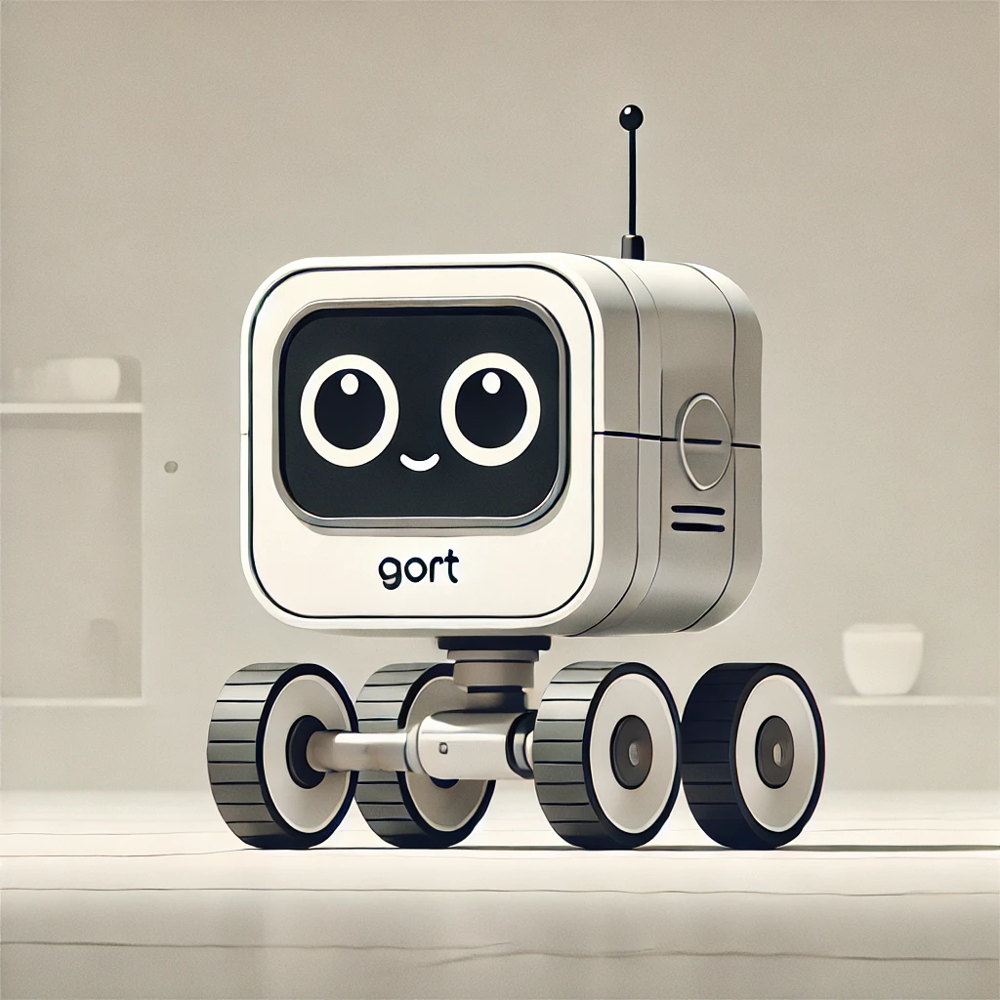

# Gort




## Dev Instructions

Project use a docker container for the development so will need to install docker and related docker dependancies before using the project.
Why Docker?
- Currently using mac, and it feels like a pain to install a vm.


### Requirements

Just install docker and follow setting up dev environment in a container ( This might be the easiest way to quick start a project in ROS ).


## Installation Instructions


Inside the ros workspace run

```bash
colcon build --symlink-install
```

then 

```bash
source install/setup.bash
```

then launch

 ```bash
ros2 launch gort_one rsp.launch.py
 ```

## Running 


### Rviz2 Controls

Open up Rviz using

```bash
rviz2
```

Wheel controls

```bash
ros2 run joint_state_publisher_gui joint_state_publisher_gui
```


### Run Gazebo

Open up Gazebo using,

```bash
ros2 launch gazebo_ros gazebo.launch.py
```

Spawn up Gazebo and start simulation,

```bash
ros2 run gazebo_ros spawn_entity.py -topic robot_description -entity bot_name
```

run with the world

```bash
ros2 launch gort_one launch_sim.launch.py world:=./src/gort_one/worlds/..
```

All in one execution module

```bash
ros2 launch gort_one launch_sim.launch.py
```


#### Control the robot 

Using Keyboard

```bash
ros2 run teleop_twist_keyboard teleop_twist_keyboard
```

Using Joystick

```bash
ros2 run teleop_twist_joy --teleop_node joy --joy_node

```

## Credits
Thanks Josh for template: [my_bot](https://github.com/joshnewans/my_bot)
